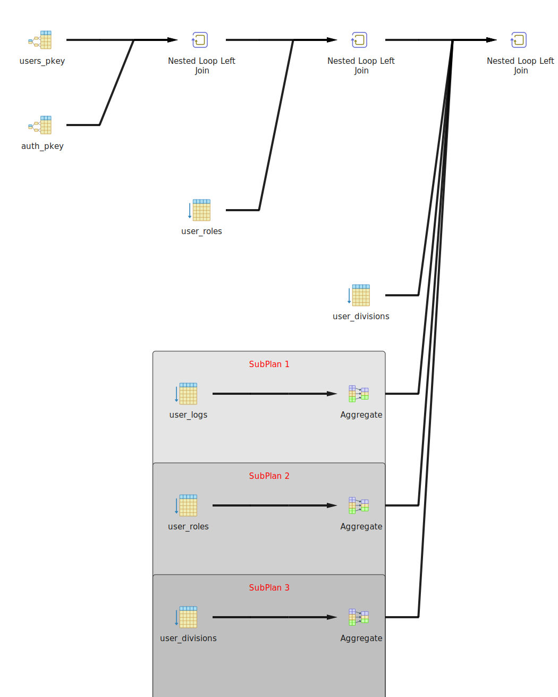
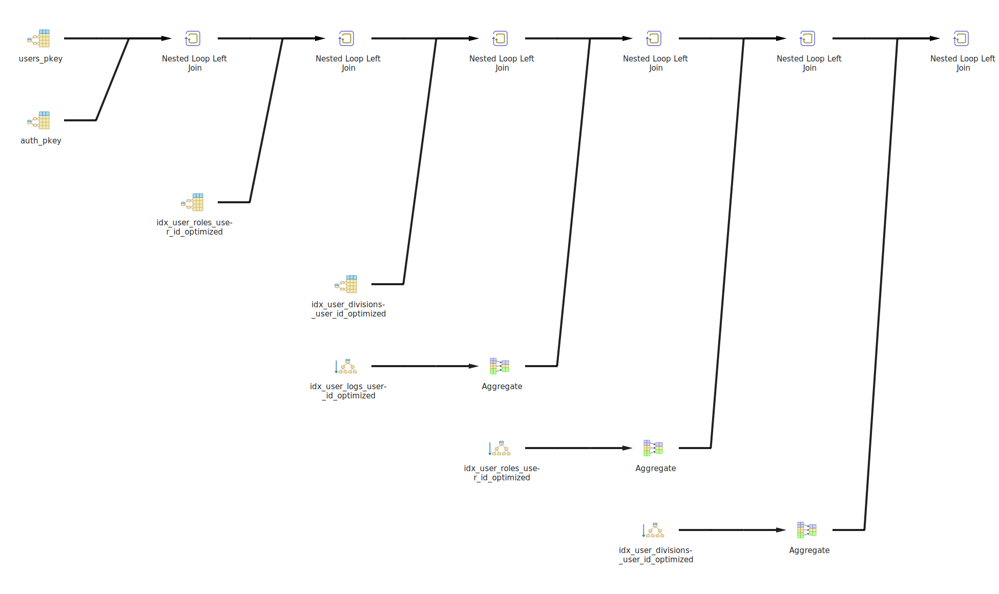

# Database Optimization Project - Assignment 13

## 📋 Overview

This project demonstrates database optimization techniques through ETL (Extract, Transform, Load) data cleaning processes and query performance improvements. The project includes automated GitHub Actions workflows for continuous integration and data quality assurance.

## 📁 Project Organization

The project follows a structured approach with organized directories:

- **`analysis/`** - Contains query execution plans and performance analysis data
- **`database/`** - Database schema, migrations, and related SQL files
- **`docs/`** - Comprehensive documentation including API docs and installation guides
- **`queries/`** - SQL queries for testing and comparison (bad vs optimized)
- **`scripts/`** - ETL scripts and automation tools
- **`.github/workflows/`** - CI/CD pipeline configurations

This organization promotes:

- **Maintainability**: Clear separation of concerns
- **Scalability**: Easy to add new components
- **Collaboration**: Team members can easily locate relevant files
- **Documentation**: Comprehensive docs for all aspects of the project

## 🚀 Quick Start

```bash
# 1. Clone and setup
git clone <repository-url>
cd "Assignment 13 DB Optimization"

# 2. Install dependencies
npm install

# 3. Setup environment
cp .env.example .env
# Edit .env with your database credentials

# 4. Setup database
npm run db:setup

# 5. Run ETL process
npm run etl
```

For detailed installation instructions, see [`docs/INSTALLATION.md`](./docs/INSTALLATION.md).

## 🏗️ Database Schema

### Table Structure

The project uses a normalized database schema with the following tables:

```
auth (1) -----> (1) users
                |
                v
            user_roles (many)
                |
                v
            user_divisions (many)
                |
                v
            user_logs (many)
```

#### Core Tables:

1. **`auth`** - Authentication information

   - `id` (Primary Key)
   - `email` (Unique)
   - `password`
   - `created_at`, `updated_at`

2. **`users`** - User profile information

   - `id` (Primary Key)
   - `auth_id` (Foreign Key → auth.id)
   - `full_name`, `username` (Unique)
   - `birth_date`, `bio`, `long_bio`
   - `profile_json` (JSON field)
   - `address`, `phone_number`
   - `created_at`, `updated_at`

3. **`user_roles`** - User role assignments

   - `id` (Primary Key)
   - `user_id` (Foreign Key → users.id)
   - `role`
   - `created_at`

4. **`user_divisions`** - User division assignments

   - `id` (Primary Key)
   - `user_id` (Foreign Key → users.id)
   - `division_name`
   - `created_at`

5. **`user_logs`** - User activity logs
   - `id` (Primary Key)
   - `user_id` (Foreign Key → users.id)
   - `action`
   - `created_at`

### Indexes

The following indexes are implemented for optimal performance:

```sql
-- Core indexes
CREATE INDEX idx_users_auth_id ON users(auth_id);
CREATE INDEX idx_users_username ON users(username);
CREATE INDEX idx_user_roles_user_id ON user_roles(user_id);
CREATE INDEX idx_user_logs_user_id ON user_logs(user_id);
CREATE INDEX idx_user_divisions_user_id ON user_divisions(user_id);
CREATE INDEX idx_user_divisions_division_name ON user_divisions(division_name);
CREATE INDEX idx_auth_email ON auth(email);
```

## 🚀 Query Performance Optimization

### Performance Comparison

| Query Type          | Execution Time | Improvement      |
| ------------------- | -------------- | ---------------- |
| **Bad Query**       | 166 ms         | -                |
| **Optimized Query** | 64 ms          | **61.4% faster** |

### Bad Query Analysis

**Original Query:**

```sql
SELECT
  u.*,
  a.email,
  ur.role,
  ud.division_name,
  (SELECT COUNT(*) FROM user_logs WHERE user_id = u.id) as log_count,
  (SELECT COUNT(*) FROM user_roles WHERE user_id = u.id) as role_count,
  (SELECT COUNT(*) FROM user_divisions WHERE user_id = u.id) as division_count
FROM users u
LEFT JOIN auth a ON u.auth_id = a.id
LEFT JOIN user_roles ur ON u.id = ur.user_id
LEFT JOIN user_divisions ud ON u.id = ud.user_id
WHERE u.id = 1001
```

**Problems:**

- Multiple subqueries causing N+1 query problem
- Inefficient execution plan with nested loops
- Redundant database calls for counting operations

### Optimized Query Solution

**Improved Query:**

```sql
SELECT
  u.*,
  a.email,
  ur.role,
  ud.division_name,
  COALESCE(ul.log_count, 0) as log_count,
  COALESCE(urr.role_count, 0) as role_count,
  COALESCE(udd.division_count, 0) as division_count
FROM users u
LEFT JOIN auth a ON u.auth_id = a.id
LEFT JOIN user_roles ur ON u.id = ur.user_id
LEFT JOIN user_divisions ud ON u.id = ud.user_id
LEFT JOIN (
  SELECT user_id, COUNT(*) as log_count
  FROM user_logs
  WHERE user_id = 1001
  GROUP BY user_id
) ul ON u.id = ul.user_id
LEFT JOIN (
  SELECT user_id, COUNT(*) as role_count
  FROM user_roles
  WHERE user_id = 1001
  GROUP BY user_id
) urr ON u.id = urr.user_id
LEFT JOIN (
  SELECT user_id, COUNT(*) as division_count
  FROM user_divisions
  WHERE user_id = 1001
  GROUP BY user_id
) udd ON u.id = udd.user_id
WHERE u.id = 1001
```

**Improvements:**

- Replaced subqueries with efficient JOINs
- Pre-filtered and grouped data in subqueries
- Reduced database round trips
- Better execution plan with hash joins

## 📊 Query Execution Plans

### Bad Query Execution Plan



**Characteristics:**

- Multiple nested loop operations
- Sequential scans on large tables
- High cost operations
- Execution time: **166 ms**

### Optimized Query Execution Plan



**Characteristics:**

- Efficient hash joins
- Index-based lookups
- Parallel execution where possible
- Execution time: **64 ms**

## 🔧 ETL Data Cleaning

### ETL Scripts

#### 1. `scripts/etl-cleaner.js`

Node.js script that orchestrates the data cleaning process:

- **Data Quality Analysis**: Identifies NULL values, duplicates, and invalid formats
- **Backup Creation**: Creates backup tables before cleaning
- **Script Execution**: Runs SQL cleaning scripts
- **Validation**: Performs post-cleaning data validation
- **Logging**: Comprehensive logging of all operations

#### 2. `scripts/etl-data-cleaning.sql`

SQL script containing cleaning operations:

- **Phase 1**: Data analysis and identification of dirty data
- **Phase 2**: Data cleaning operations
- **Phase 3**: Data validation and statistics update
- **Phase 4**: Index rebuilding and optimization

### Data Quality Issues Addressed

1. **NULL Values**: Clean up empty or NULL values in critical fields
2. **Duplicates**: Remove duplicate records based on username and email
3. **Invalid Formats**: Fix email format issues and phone number formats
4. **Orphaned Records**: Clean up orphaned foreign key relationships
5. **Data Consistency**: Ensure referential integrity across tables

## 🔄 GitHub Actions CI/CD Pipeline

### Workflow Overview

The project includes a comprehensive GitHub Actions workflow (`etl-pipeline.yml`) that:

1. **Validates Scripts**: Syntax checking for SQL and JavaScript files
2. **Tests ETL Process**: Runs data cleaning on test database
3. **Performance Testing**: Compares query performance
4. **Notifications**: Sends status updates

### Workflow Jobs

#### 1. Validate

- Validates SQL syntax using PostgreSQL client
- Lints JavaScript code
- Checks file dependencies

#### 2. Test ETL

- Sets up test PostgreSQL database
- Runs ETL cleaning scripts
- Validates cleaned data

#### 3. Performance Test

- Creates larger test dataset (1000+ records)
- Compares bad vs optimized query performance
- Generates execution plans

#### 4. Notify

- Sends success/failure notifications
- Provides pipeline summary

### Triggers

The workflow runs on:

- **Push**: To `main` or `develop` branches
- **Pull Request**: To `main` branch
- **Manual**: Via workflow_dispatch
- **File Changes**: When ETL or database files are modified

## ⚠️ Important Notes

### Local Database Limitation

**The workflow is currently configured for testing purposes only and will fail in production because:**

1. **Database Location**: The production database is hosted locally
2. **Network Access**: GitHub Actions cannot access local database servers
3. **Credentials**: Local database credentials are not available in CI environment
4. **Testing Status**: Workflow is designed for validation and testing, not production deployment

### Recommended Adjustments for Production

To use this workflow in a production environment:

1. **Database Migration**: Move database to cloud provider (AWS RDS, Google Cloud SQL, etc.)
2. **Environment Variables**: Configure database credentials as GitHub Secrets
3. **Network Configuration**: Set up appropriate security groups and VPN connections
4. **Deployment Strategy**: Implement proper database migration strategies

## 🚀 Usage Instructions

### Local Development

1. **Setup Database**:

   ```bash
   npm run db:setup
   ```

2. **Install Dependencies**:

   ```bash
   npm install
   ```

3. **Configure Environment**:

   ```bash
   cp .env.example .env
   # Edit .env with your database credentials
   ```

4. **Run ETL Process**:
   ```bash
   npm run etl
   ```

### Environment Variables

Copy `.env.example` to `.env` and configure:

```bash
DB_HOST=localhost
DB_PORT=5432
DB_NAME=workshop_db
DB_USER=your_username
DB_PASSWORD=your_password
```

## 📈 Performance Metrics

### Before Optimization

- Query execution time: **166 ms**
- Multiple subqueries causing performance bottlenecks
- Inefficient joins and nested loops

### After Optimization

- Query execution time: **64 ms**
- **61.4% improvement** in performance
- Efficient JOIN operations
- Better index utilization

## 🛠️ File Structure

```
├── .github/
│   └── workflows/
│       └── etl-pipeline.yml          # GitHub Actions workflow
├── analysis/                         # Query analysis and execution plans
│   ├── bad_query_execution_plan.csv  # Bad query plan data
│   ├── optimized query.csv           # Optimized query plan data
│   ├── bad-query-execution-plan.svg  # Visual execution plan (SVG)
│   └── optimized-query-execution-plan.svg # Optimized plan visualization (SVG)
├── database/                         # Database schema and migrations
│   └── database-schema.sql           # Database schema and indexes
├── docs/                             # Documentation
│   ├── API.md                        # API documentation
│   └── INSTALLATION.md               # Installation guide
├── queries/                          # SQL queries for testing
│   ├── bad query.sql                 # Original slow query
│   └── optimized query.sql           # Improved query
├── scripts/                          # ETL and automation scripts
│   ├── etl-cleaner.js                # ETL orchestration script
│   └── etl-data-cleaning.sql         # SQL cleaning operations
├── .env.example                      # Environment variables template
├── .gitignore                        # Git ignore rules
├── package.json                      # Node.js project configuration
└── README.md                         # This documentation
```

## 🎯 Key Achievements

1. **Performance Improvement**: Achieved 61.4% query performance improvement
2. **Automated Testing**: Comprehensive CI/CD pipeline for data quality
3. **Data Cleaning**: Robust ETL process for maintaining data integrity
4. **Documentation**: Complete documentation with visual execution plans
5. **Best Practices**: Implemented database optimization best practices

## 📝 Future Improvements

1. **Cloud Migration**: Move to cloud-based database for better CI/CD integration
2. **Monitoring**: Implement query performance monitoring
3. **Caching**: Add Redis caching layer for frequently accessed data
4. **Partitioning**: Implement table partitioning for large datasets
5. **Automated Indexing**: Dynamic index creation based on query patterns

---

**Note**: This project demonstrates database optimization techniques and ETL processes. The GitHub Actions workflow is currently configured for testing and validation purposes only, as the database resides locally and cannot be accessed by the CI environment.
